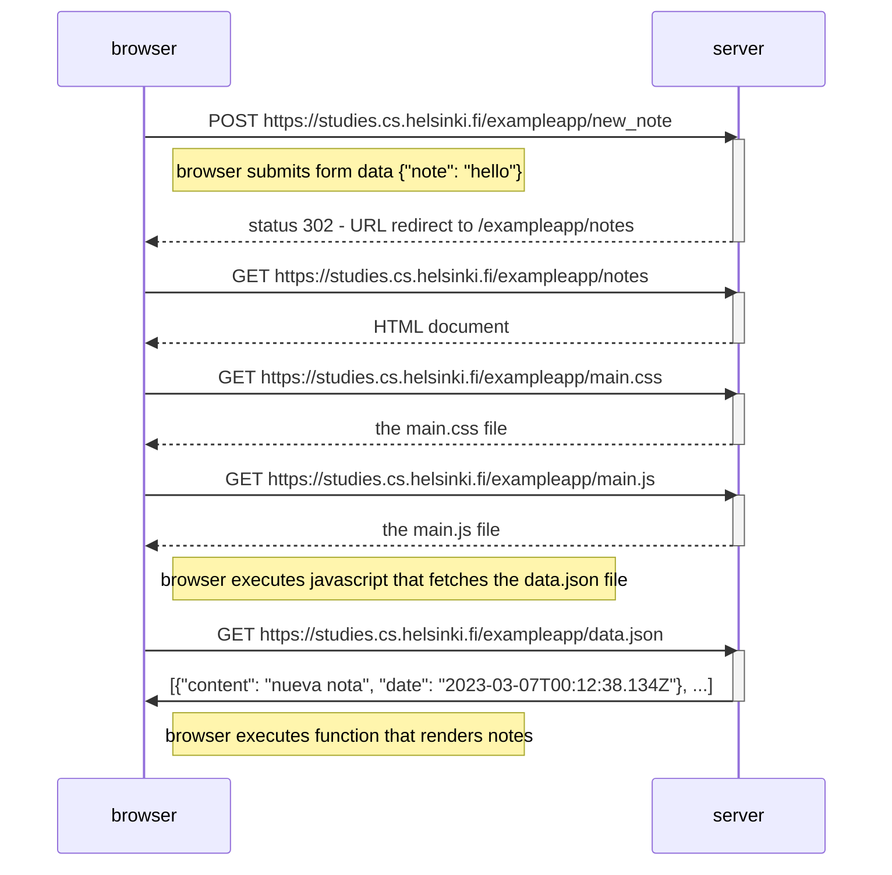

```mermaid
sequenceDiagram
    participant browser
    participant server
    
    browser->>server: POST https://studies.cs.helsinki.fi/exampleapp/new_note
    activate server
    Note right of browser: browser submits form data {"note": "hello"}
    server-->>browser: status 302 - URL redirect to /exampleapp/notes
    deactivate server
    
    browser->>server: GET https://studies.cs.helsinki.fi/exampleapp/notes
    activate server
    server-->>browser: HTML document
    deactivate server
    
    browser->>server: GET https://studies.cs.helsinki.fi/exampleapp/main.css
    activate server
    server-->>browser: the main.css file
    deactivate server
    
 
    browser->>server: GET https://studies.cs.helsinki.fi/exampleapp/main.js
    activate server
    server-->>browser: the main.js file
    deactivate server
    Note right of browser: browser executes javascript that fetches the data.json file

    browser->>server: GET 	https://studies.cs.helsinki.fi/exampleapp/data.json
    activate server
    server->>browser: [{"content": "nueva nota", "date": "2023-03-07T00:12:38.134Z"}, ...]
    deactivate server
    Note right of browser: browser executes function that renders notes
```