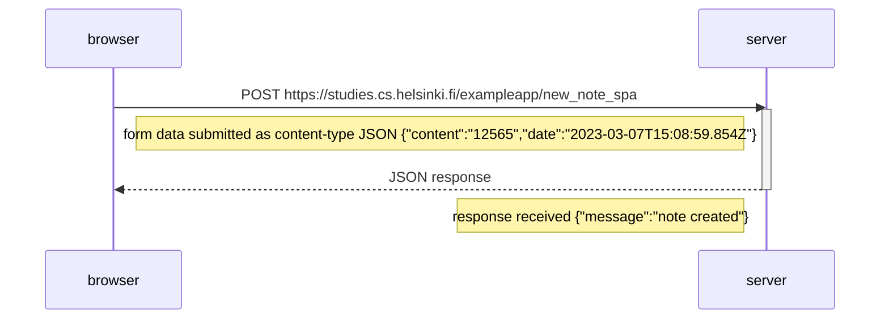

```mermaid
sequenceDiagram
    participant browser
    participant server
    
    browser->>server: POST https://studies.cs.helsinki.fi/exampleapp/new_note_spa
    activate server
    Note right of browser: form data submitted as content-type JSON {"content":"12565","date":"2023-03-07T15:08:59.854Z"}
    server-->>browser: JSON response
    deactivate server
    Note left of server: response received {"message":"note created"}
```  